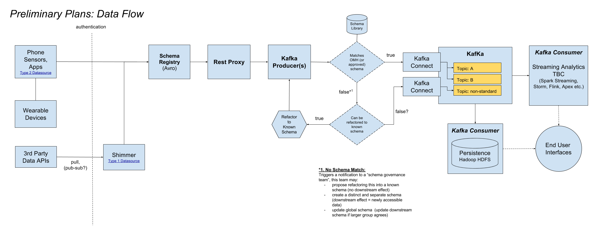
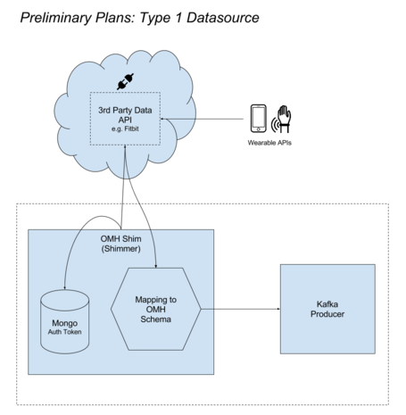
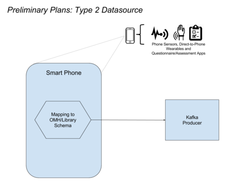

RADAR-platform
==============
The repository for work on the RADAR platform, a scalable, generic data harvesting pipeline for harvesting data from mobile phone sensors, IoT/wearable, questionnaires and assessment apps devices etc.  Remote Assessment of Disease and Relapse (RADAR) project. RADAR is a 22 million (11M European Funding and matched funding from EFPIA partners) European FP-7 initiative to pioneer mHealth remote monitoring capabilities in 3 key neurological disease areas: Depression, MS and Epilepsy.

Broadly are building a community-driven software stack for harvesting data from smartphone and IoT type datasources. The range of potential datasources is rapidly expanding and the use cases for this data are undetermined and difficult to predict therefore the challenge is to build in the greatest flexibility such that new datasources can easily and consistently be added and new uses of the data can be built on-top of this core framework.

RADAR Platform Goals
--------------------
1. Develop a scalable, open source data harvesting platform
2. While advocating a set of standardised data schema, provide a parallel ingestion pathway for schema that are not congruent with the standard.
3. Provide a standard schema repository (presently leverage Open mHealth Schema libraries)
4. Publish a Producer catalogue to promote re-use and maintenance of data connectors
5. Streaming and Batch analytics 

Preliminary Architecture
-------------------------

Data Source Types
-----------------
*Type 1 Data Source*

*Type 2 Data Source*

Deployment Instructions
=======================

